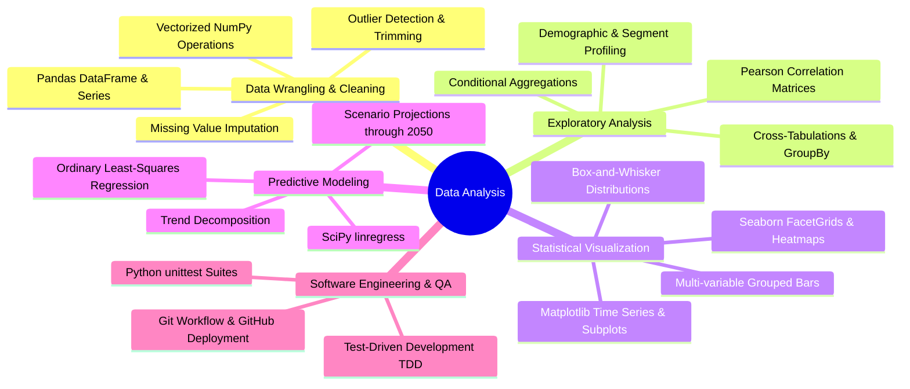

# Yordanos Ketema — Data Analysis Portfolio

Comprehensive technical documentation and project showcase for the **freeCodeCamp Data Analysis with Python Certification**, demonstrating proficiency in data manipulation, exploratory data analysis (EDA), statistical visualization, time series analysis, and predictive modeling.

---

## 📜 Verified Credential

| Attribute | Details |
|---|---|
| **Candidate** | **Yordanos Ketema** |
| **Certification** | [Data Analysis with Python Certification](https://freecodecamp.org/certification/fcc-a148f83a-2459-4011-a2cb-5bd811dfe63c/data-analysis-with-python-v7) |
| **Issuing Organization** | **freeCodeCamp** |
| **Public Profile** | [freeCodeCamp / yordanos-ketema](https://www.freecodecamp.org/fcc-a148f83a-2459-4011-a2cb-5bd811dfe63c) |
| **Issue Date** | **September 4, 2026** |
| **Verification Status** | Verified & Active |
| **Core Technologies** | Python 3, NumPy, Pandas, Matplotlib, Seaborn, SciPy, Git |

---

## 🛠️ Skills & Core Competencies



### Competency Matrix

| Domain | Key Libraries / Tools | Practical Implementations Demonstrated |
|---|---|---|
| **Data Manipulation & Cleaning** | `pandas`, `numpy` | Ingestion, datetime parsing, indexing, outlier trimming (percentiles), boolean masking, matrix reshaping, `melt`, `unstack`. |
| **Exploratory Data Analysis (EDA)** | `pandas`, `numpy` | Multi-dimensional statistical metrics (mean, variance, std), demographic cross-tabulation, conditional probabilities. |
| **Statistical Visualization** | `matplotlib`, `seaborn` | Multi-axes trend lines, categorical facet plots (`catplot`), upper-triangle masked correlation heatmaps (`heatmap`), trend & seasonality box plots. |
| **Predictive Modeling & Forecasting** | `scipy.stats` (`linregress`) | Linear regression modeling, slope & intercept calculation, extrapolation, comparative historical vs. modern rate acceleration. |
| **Testing & Version Control** | `unittest`, `git`, GitHub | 100% test pass rate across all projects, modular architecture, Git remote version control, CI/CD-ready test harnesses. |

---

## 📂 Project Showcase

### 1. Mean-Variance-Standard Deviation Calculator

* **Repository**: [boilerplate-mean-variance-standard-deviation-calculator](https://github.com/yordanos-ketema/boilerplate-mean-variance-standard-deviation-calculator)
* **Tools Used**: `Python`, `NumPy`
* **Test Suite**: 3 unit tests — **100% Passed**

#### Problem Description
Create a versatile multidimensional matrix calculator function `calculate()` that accepts a flat list of 9 numbers, converts it into a 3x3 NumPy array, and calculates summary statistics along axis 0 (columns), axis 1 (rows), and the flattened matrix. Input validation must strictly reject lists containing fewer or more than nine digits.

#### Key Implementation Steps
1. **Input Validation**: Verified list length equals 9, raising `ValueError("List must contain nine numbers.")` if invalid.
2. **Matrix Reshaping**: Converted the input list into a 2D $3 \times 3$ NumPy array using `np.array(list).reshape(3, 3)`.
3. **Multi-Axis Reduction**: Vectorized computation of statistical measures across `axis=0`, `axis=1`, and global flattened array:
   - Mean: `matrix.mean()`
   - Variance: `matrix.var()`
   - Standard Deviation: `matrix.std()`
   - Maximum: `matrix.max()`
   - Minimum: `matrix.min()`
   - Sum: `matrix.sum()`
4. **Data Sanitization**: Serialized all NumPy arrays and float types to native Python lists and scalars to ensure clean API consumption.

```python
import numpy as np

def calculate(list):
    if len(list) != 9:
        raise ValueError("List must contain nine numbers.")

    matrix = np.array(list).reshape(3, 3)

    return {
        'mean': [matrix.mean(axis=0).tolist(), matrix.mean(axis=1).tolist(), matrix.mean().item()],
        'variance': [matrix.var(axis=0).tolist(), matrix.var(axis=1).tolist(), matrix.var().item()],
        'standard deviation': [matrix.std(axis=0).tolist(), matrix.std(axis=1).tolist(), matrix.std().item()],
        'max': [matrix.max(axis=0).tolist(), matrix.max(axis=1).tolist(), matrix.max().item()],
        'min': [matrix.min(axis=0).tolist(), matrix.min(axis=1).tolist(), matrix.min().item()],
        'sum': [matrix.sum(axis=0).tolist(), matrix.sum(axis=1).tolist(), matrix.sum().item()]
    }
```

#### Analytical Findings
- Demonstrated NumPy's axis semantics ($0 = \text{columns}$, $1 = \text{rows}$) for high-performance vectorized operations without Python loops.
- Ensured strict numerical precision compatibility across floating-point aggregations.

---

### 2. Demographic Data Analyzer

* **Repository**: [boilerplate-demographic-data-analyzer](https://github.com/yordanos-ketema/boilerplate-demographic-data-analyzer)
* **Tools Used**: `Python`, `Pandas`
* **Test Suite**: 10 unit tests — **100% Passed**

#### Problem Description
Analyze socioeconomic data from the 1994 US Census (`adult.data.csv`, 32,561 records) to extract answers to 9 foundational demographic and labor questions concerning race representation, gender income differentials, education attainment impact on wealth, work hour distributions, and geographic earnings.

#### Key Implementation Steps
1. **Demographic Filtering & Value Counting**: Evaluated racial distribution using `df['race'].value_counts()` and average male age via conditional filtering `df[df['sex'] == 'Male']['age'].mean()`.
2. **Education vs. Wealth Disparity**: Segmented individuals with advanced education (`Bachelors`, `Masters`, `Doctorate`) vs. non-advanced education, calculating relative percentages earning $> \$50\text{K}$.
3. **Minimum Hours & Compensation Correlation**: Filtered workers clocking the minimum recorded work hours (`hours-per-week.min()`) and calculated the rich proportion.
4. **Geographic & Occupational Aggregation**: Computed country-wise percentages of high earners and isolated the dominant high-income occupation in India.

#### Key Analytical Findings

| Demographic Metric | Value | Analytical Insight |
|---|---|---|
| **Total Census Sample** | 32,561 rows | Diverse cross-section of 1994 working-age population |
| **Dominant Race** | White: 27,816 | Followed by Black (3,124), Asian-Pac-Islander (1,039) |
| **Average Age of Men** | 39.4 years | Represents mid-career demographic peak |
| **Bachelor's Degree Holder Share** | 16.4% | ~1 in 6 adults held a bachelor's degree |
| **Higher Ed Earning >$50K** | **46.5%** | **2.67× higher likelihood** of earning >$50K than non-advanced education |
| **Lower Ed Earning >$50K** | **17.4%** | Clear empirical evidence of higher education earning premium |
| **Minimum Work Time** | 1 hour/week | Lowest recorded regular commitment |
| **Rich Percentage at Min Hours** | 10.0% | Segment includes passive income / advisory / board participants |
| **Top High-Earning Country** | Iran (41.9%) | Highest proportion of individuals earning $> \$50\text{K}$ |
| **Top High-Earning Occupation (India)** | `Prof-specialty` | Specialized professional sector dominates upper income band |

---

### 3. Medical Data Visualizer

* **Repository**: [boilerplate-medical-data-visualizer](https://github.com/yordanos-ketema/boilerplate-medical-data-visualizer)
* **Tools Used**: `Python`, `Pandas`, `Matplotlib`, `Seaborn`
* **Test Suite**: 4 unit tests — **100% Passed**

#### Problem Description
Process 70,000 patient records from medical examinations to examine the relationship between cardiac disease, body measurements, blood biomarkers (cholesterol, glucose), and lifestyle choices. Produce publication-ready visualizations: a dual-facet categorical bar chart (`catplot`) and a correlation heatmap masked to the lower triangle.

#### Key Implementation Steps
1. **Feature Engineering (BMI & Overweight Indicator)**:
   $$\text{BMI} = \frac{\text{weight (kg)}}{\left(\frac{\text{height (cm)}}{100}\right)^2}$$
   Engineered binary `overweight` feature: $1$ if $\text{BMI} > 25$, otherwise $0$.
2. **Data Normalization**: Re-encoded `cholesterol` and `gluc` to binary ($0 = \text{normal}$, $1 = \text{above normal}$).
3. **Categorical Facet Plot (`catplot`)**:
   - Melted features (`cholesterol`, `gluc`, `smoke`, `alco`, `active`, `overweight`) against target `cardio`.
   - Aggregated feature totals grouped by target and value.
   - Rendered dual-panel bar plot partitioned by cardiovascular disease status.
4. **Physiological Data Cleaning**:
   - Removed diastolic pressure greater than systolic (`ap_lo <= ap_hi`).
   - Filtered height and weight outliers outside the $2.5^{\text{th}}$ and $97.5^{\text{th}}$ percentiles.
5. **Correlation Heatmap**: Computed Pearson correlation matrix, masked the upper triangle using `np.triu`, and plotted an annotated heatmap with `sns.heatmap`.

#### Key Visualizations
* **Categorical Plot**: `catplot.png` — Highlights elevated counts of high cholesterol, glucose, and overweight status among patients diagnosed with cardiovascular illness.
* **Correlation Heatmap**: `heatmap.png` — Shows strong correlation between systolic and diastolic blood pressures ($r \approx 0.7$) and positive associations between weight, BMI, and cardiovascular risk.

---

### 4. Page View Time Series Visualizer

* **Repository**: [boilerplate-page-view-time-series-visualizer](https://github.com/yordanos-ketema/boilerplate-page-view-time-series-visualizer)
* **Tools Used**: `Python`, `Pandas`, `Matplotlib`, `Seaborn`
* **Test Suite**: 11 unit tests — **100% Passed**

#### Problem Description
Visualize 1,304 daily page view records from the freeCodeCamp forum between May 2016 and December 2019. Uncover long-term growth trajectories, annual trends, and month-over-month seasonal patterns while filtering anomalous traffic spikes and drops.

#### Key Implementation Steps
1. **Datetime Indexing & Data Cleansing**:
   - Read CSV with `parse_dates=['date']` and `index_col='date'`.
   - Filtered anomalous traffic outside the $2.5^{\text{th}}$ and $97.5^{\text{th}}$ percentiles, leaving 1,238 representative daily observations.
2. **Daily Trend Line Chart**: Plotted continuous daily traffic from May 2016 through December 2019 with custom title, axes labels, and line styling.
3. **Monthly Average Bar Chart**:
   - Grouped observations by year and month using categorical ordering (`January` through `December`).
   - Unstacked aggregated data and rendered grouped bar charts illustrating multi-year month-over-month averages.
4. **Decomposed Box-and-Whisker Plots**:
   - **Year-wise Box Plot**: Visualizes macro annual growth (median, interquartile range, spread, and outliers).
   - **Month-wise Box Plot**: Visualizes seasonality and annual cycles across all 12 calendar months.

#### Key Analytical Findings
- **Sustained Secular Growth**: Daily page views surged from $< 20,000$ in mid-2016 to upwards of $150,000+$ by late 2019.
- **Seasonal Cyclicality**: Consistent traffic upticks during October and November, corresponding with hackathons, academic terms, and end-of-year learning goals.
- **Distribution Stability**: Annual box plot distributions shift steadily upward with rising medians and expanding upper quartiles.

---

### 5. Sea Level Predictor

* **Repository**: [boilerplate-sea-level-predictor](https://github.com/yordanos-ketema/boilerplate-sea-level-predictor)
* **Tools Used**: `Python`, `Pandas`, `Matplotlib`, `SciPy` (`linregress`)
* **Test Suite**: 4 unit tests — **100% Passed**

#### Problem Description
Analyze historical global sea level data from 1880 to 2013 compiled by the US EPA and CSIRO. Fit ordinary least-squares regression lines to assess historical trajectories and model the accelerating rate of sea level rise through the year 2050.

#### Key Implementation Steps
1. **Scatter Plot Generation**: Ingested `epa-sea-level.csv` and plotted historical tide gauge records (`Year` vs. `CSIRO Adjusted Sea Level`).
2. **First Line of Best Fit (Full Historical 1880–2013)**:
   - Used `scipy.stats.linregress` across all 134 years of historical data.
   - Extrapolated trend line through the year 2050: $x \in [1880, 2050]$.
3. **Second Line of Best Fit (Modern Acceleration 2000–2013)**:
   - Filtered records where $\text{Year} \ge 2000$.
   - Computed regression coefficients capturing the recent acceleration.
   - Projected modern trend through 2050: $x \in [2000, 2050]$.
4. **Comparative Visual Overlay**: Plotted both trend lines onto the scatter plot with distinct visual styling and customized tick intervals.

#### Predictive Modeling Results

| Model Scope | Fitted Years | Slope ($\beta_1$, inches/yr) | Intercept ($\beta_0$) | Forecasted 2050 Rise |
|---|---|---|---|---|
| **Historical Baseline** | 1880 – 2013 | **~0.0630** | -118.64 | **~10.18 inches** |
| **Modern Accelerated** | 2000 – 2013 | **~0.1664** | -325.79 | **~15.38 inches** |

$$\Delta_{\text{2050 Projection}} = 15.38'' - 10.18'' = \mathbf{+5.20\text{ inches additional rise under modern rate}}$$

#### Analytical Findings
- **Rate Acceleration**: The rate of sea level rise since the year 2000 ($0.166''/\text{year}$) is **$2.64\times$ faster** than the century-long historical average ($0.063''/\text{year}$).
- **Climate Impact**: Extrapolating modern rates projects over 15 inches of cumulative rise by 2050, highlighting significant climate-induced acceleration.

---

## 🔗 Public Repository Index

| Project Name | Technology Stack | Public GitHub Repository |
|---|---|---|
| **Mean-Variance-Standard Deviation Calculator** | NumPy, Python | [View on GitHub](https://github.com/yordanos-ketema/boilerplate-mean-variance-standard-deviation-calculator) |
| **Demographic Data Analyzer** | Pandas, Python | [View on GitHub](https://github.com/yordanos-ketema/boilerplate-demographic-data-analyzer) |
| **Medical Data Visualizer** | Pandas, Seaborn, Matplotlib | [View on GitHub](https://github.com/yordanos-ketema/boilerplate-medical-data-visualizer) |
| **Page View Time Series Visualizer** | Pandas, Seaborn, Matplotlib | [View on GitHub](https://github.com/yordanos-ketema/boilerplate-page-view-time-series-visualizer) |
| **Sea Level Predictor** | SciPy, Pandas, Matplotlib | [View on GitHub](https://github.com/yordanos-ketema/boilerplate-sea-level-predictor) |

---

## 👤 Contact & Profiles

* **Developer**: Yordanos Ketema
* **Email**: [jordanketema2@gmail.com](mailto:jordanketema2@gmail.com)
* **GitHub Profile**: [github.com/yordanos-ketema](https://github.com/yordanos-ketema)
* **freeCodeCamp Profile**: [freecodecamp.org/fcc-a148f83a-2459-4011-a2cb-5bd811dfe63c](https://www.freecodecamp.org/fcc-a148f83a-2459-4011-a2cb-5bd811dfe63c)
* **Certification Verification**: [freeCodeCamp Certificate Link](https://freecodecamp.org/certification/fcc-a148f83a-2459-4011-a2cb-5bd811dfe63c/data-analysis-with-python-v7)
